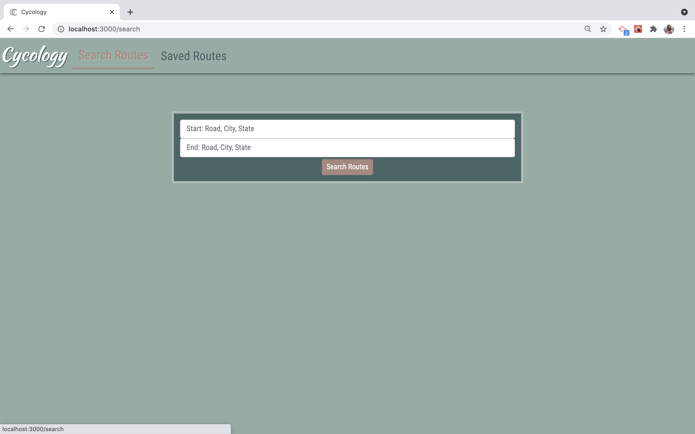
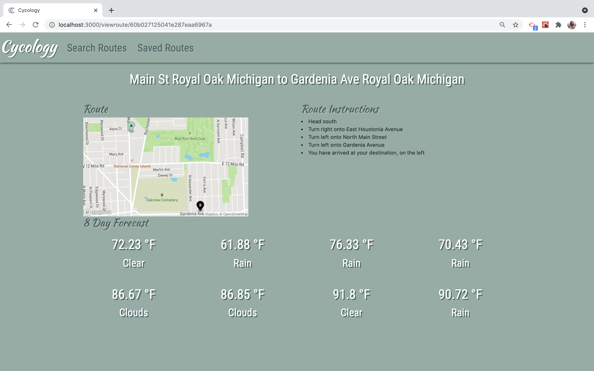
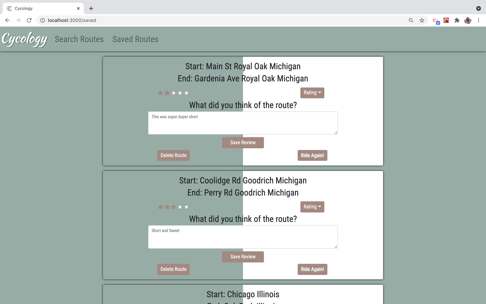

# Cycology

## Description

People who live an active lifestyle either have a hard time finding routes or remembering routes they have taken before. This application, enables cyclists to enter a start and end destination and have a cycle-friendly route created for them with step by step instructions.

The cyclist will also be given a weather forecast for the current day, so they can choose the best conditions to ride in.  If the cyclist enjoys the route they are able to save it and review it at a later date.

## Table of Contents

* [Deployed_Application](#Deployed_Application)
* [Usage](#Usage)
* [Mockup](#Mock-Up)
* [License](#License)
* [Questions](#Questions)

## Deployed Application

Access the deployed application at: [Cycology](https://glacial-tundra-95174.herokuapp.com/)

## Usage

Cyclology was designed to meet the following user story while utilizing technolgies MongoDB, Node, Express, React, JavaScript, and API Routes.

As a cyclist I want to be able to select a cycling route so that I can find new locations to bike
As a cyclist I want bike friendly routes so that I can have customized instructions for biking
As a cyclist I want to know the weather the day I ride so that I can prepare properly
As a cyclist I want to save my route so that I can take it again later

To access route instructions, Map Box API was utilized: [MapBox API](https://docs.mapbox.com/api/overview/)

In order to gain access to weather, Open Weather Map was utilized. [OpenWeather API](https://openweathermap.org/api)

## Mock-Up

The following image shows the application’s basic functionality:

Search Page: 
View A Route: 
Saved Routes: 

## License

Thisapplication has a MIT License type. Please read more about permissions at [Choose A License](https://choosealicense.com/licenses/)

## Questions

Please reach out to us with any additional questions:

Jacqueline Ross: [ross1jk](https://github.com/ross1jk)
Diego Romero: [romerodi](https://github.com/romerodi)
Matt Williams: [onlymattwill515](https://github.com/onlymattwill515)
