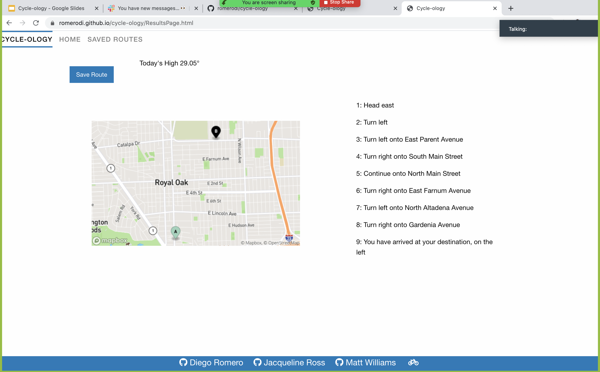

# Cycle-ology

## Description

People who live an active lifestyle either have a hard time finding routes or remembering routes they have taken before. This application, enables cyclists to enter a start and end destination and have a cycle-friendly route created for them with step by step instructions. 

The cyclist will also be given a weather forecast for the current day, so they can choose the best conditions to ride in.  If the cyclist enjoys the route they are able to save it and review it at a later date. 

This application is updated dynamically using HTML, CSS and JavaScript/jQuery functionality. 
To access instructions, Map Box API was utilized: [MapBox API](https://docs.mapbox.com/api/overview/)  In order to gain access to weather, Open Weather Map was utilized. [OpenWeather API](https://openweathermap.org/api)

For basic layouts and styling, foundation was used.


## User Story

Cycle-ology was designed to meet the following user story:

```
As a cyclist I want to be able to select a cycling route so that I can find new locations to bike 
As a cyclist I want bike friendly routes so that I can have customized instructions for biking
As a cyclist I want to know the weather the day I ride so that I can prepare properly
As a cyclist I want to save my route so that I can take it again later 
 
```

## Deployed Application

Access the deployed application at: https://romerodi.github.io/cycle-ology/search-element 

## Mock-Up

The following image shows the application’s basic functionality:

Search Page: 
Route Display: 
Saved Routes: 

## Wire Frame

Access the wire frame we utilized for planning at: [Miro](https://miro.com/welcomeonboard/HTJ4TviMugWkwy4R2McWWslBklyGJI3BWfBQeokBmWAjRJbCDH5RAYV7oNL0yHzM)

## Group Presentation

View our project presnetation at: https://docs.google.com/presentation/d/1yNftxc7JPVH8dqJcKom2ABU-CCicM2JJ9L4jGWHSaoA/edit?usp=sharing 

# Cycling Application Break Down

## Folder Structure

To follow industry best practices our application folder structure is as follows. 

**search-element.html** Home page, where search functionality is at. 

**ResultsPage.html** displays searched routes 

**savedroutes.html** displays saved routes 

**README.md** Stands on it own, outside of any folder.

**images** This folder contains the mock-up images for the cycling route project. 

**scripts** This folder contains script.js, ADD MORE IF NEEDED 

**styles** This folder contains the search-element-style.css  ADD MORE IF NEEDED 

## HTML 

Each HTML Document contains a navbar and footer with that are all the same. 

### search-element.html

This page consists of a search element, for start location, end location and date. 

### ResultsPage.html

This page consists of a save button, rate route button, a div that will hold the route searched, a div that will display the instructions of the route searched, and a div that will hold the current weather. 

### saved routes.html

This page consists of an empty div that is populated through local storage to display any routes that were saved by the user. 

## CSS 

**resultspage.css** This CSS file provides styling to the reuslts page for a overall clean look. 

**footer.css** This page is used to style the footer on each page. The footer is fixed to the bottom of the page displayed, updated dynamically depending on the page size, and contains links to our githubs and github repo.

**search-element-style** this is used to style the navbar of each page. 

**saved.css** this styled the saved routes page to be more visually appealing. 

## jQuery / JavaScript

### Functions

**findCoordinates** uses geocoding to get longitude and latitude for cycling directions sets to local storage for later use

**createRoute** Creates a route using mapbox api 

**savedroutes** stores the saved routes and displays to html page- saved routes

### API

**GeoCode** Used from mapbox, used to store start and end longitude and latitude so it can be used in WeatherAPI, Route Instructions API, and the Map URL

**Route Instructions** uses stored longitude and latitude to gather instructions, then stores that api response as an array, that is looped through to get step by step route instructions. Displays to ResultsPage.html

**mapurl** uses stored long and lat, to set to add to mapbox url, then displays map on ResultsPage.html

**Weather** uses stored long and lat, to get the upcoming weather for upcoming day. displays to ResultsPage.html

### Event Listeners / Buttons 

**searchBtn**  saves start location, end location, and date to local storage 

**SaveRouteButton** saves the last route searched 

## Project Contributors

Diego Romero: https://github.com/romerodi,
Jacqueline Ross: https://github.com/ross1jk, 
Matt Williams: https://github.com/onlymattwill515
